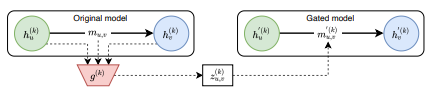



### Clustering for Graph-structured Data using Graph Neural Networks   [[PyTorch Geometric](https://pytorch-geometric.readthedocs.io/en/latest/generated/torch_geometric.nn.dense.DMoNPooling.html#torch_geometric.nn.dense.DMoNPooling)/[Code](https://github.com/fork123aniket/Graph-Clustering-using-Graph-Neural-Networks-from-scratch)]

- This contribution relates to adding up a fast, yet effective graph clustering technique to PyTorch Geometric library
based on **Spectral Modularity Maximization**.
- A multi-layer graph convolutional network (GCN) is used to learn the hidden representations of each of the nodes
in the graph.
- Softmax activation is then applied to the output of GCN to obtain **soft**, **yet differentiable cluster assignments**
being made for the input graph.
- Designed and implemented unit tests to confirm the correctness of the clustering technique.
- Libraries/Framework: *PyTorch*, *PyTorch Geometric*, and *PyTest*

### Model-agnostic Graph Explainability   [[PyTorch Geometric](https://pytorch-geometric.readthedocs.io/en/latest/modules/contrib.html#torch_geometric.contrib.explain.GraphMaskExplainer)/[Code](https://github.com/fork123aniket/Model-agnostic-Graph-Explainability-from-Scratch)]

- This contribution aims at adding a **Graph Explainability solution** powered by **hard-concrete distribution** to PyTorch Geometric.
based on **Spectral Modularity Maximization**.
- 
Implemented a <i>post-hoc model-agnostic graph explainability</i> technique, which, at every hidden layer of the GNN model, computed explanation weights for  
  every edge in the population and produced explanatory subgraph as output.

- 
Softmax activation is then applied to the output of GCN to obtain <i>soft</i>, yet  
  <i>differentiable cluster assignments</i> being made for the input graph.

- 
Implemented custom unit tests to ensure proper execution of the Graph 
  Explainability technique.

- Libraries/Framework: *Numpy*, *tqdm*, *PyTorch*, *PyTorch Geometric*, and *PyTest*
  
### Relational Graph Attention Networks   [[PyTorch Geometric](https://pytorch-geometric.readthedocs.io/en/latest/generated/torch_geometric.nn.conv.RGATConv.html#torch_geometric.nn.conv.RGATConv)/[Code](https://github.com/fork123aniket/Relational-Graph-Attention-from-Scratch)]

- This contribution relates to bringing attention to heterogeneous (relational) graphs and incorporating this
relation-aware attention operator into PyTorch Geometric Library.
- Offers two different mechanisms to compute attention for relational graphs, i.e. **within-relation** and **across-relation**.
- This implementation also provides four different cardinality preservation options (**additive**, **scaled**, **f-additive**, and
**f-scaled**) to further improve attention computation for the heterogeneous graphs.
- Wrote custom unit tests to verify the technique’s accuracy.
- Libraries/Framework: *torch-scatter*, *torch-sparse*, *PyTorch*, *PyTorch Geometric*, and *PyTest*
