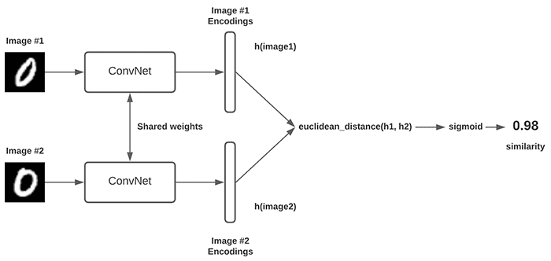
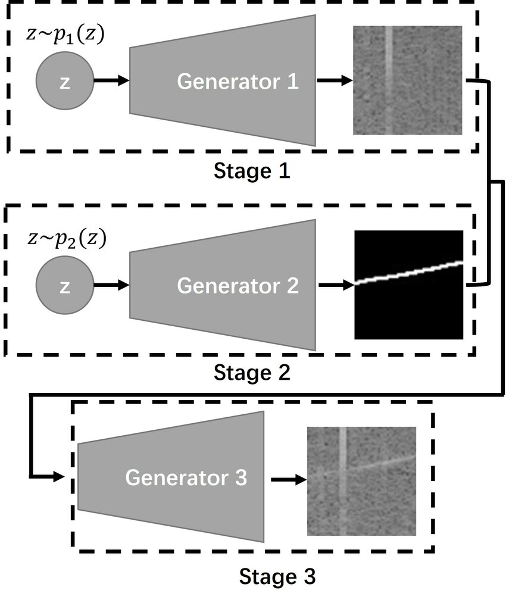
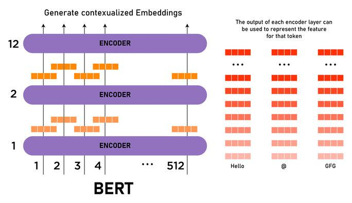
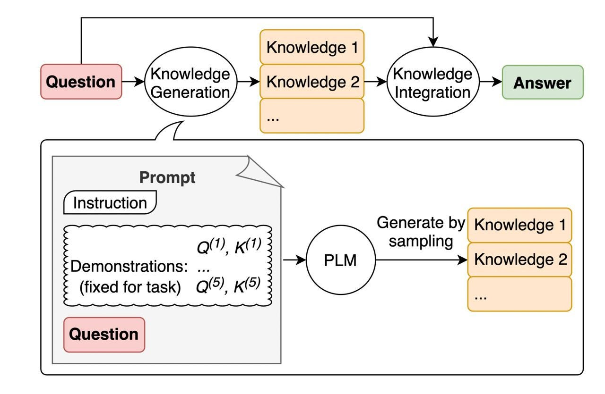



Below is a non-exhaustive list of my non-research projects. You can also check out a complete list of my projects [here](https://github.com/fork123aniket?tab=repositories).

### Contrastive Learning-based Few-shot Image Classification   [[Code](https://github.com/fork123aniket/Visual-Contrastive-Learning-for-Few-shot-Image-Classification)]

- Defined a custom contrastive loss and trained a **few-shot** version of Siamese Networks to do **n-way k-shot**
image classification by mapping the image similarity task into a fully-supervised classification learning task.
- Libraries/Framework: *Numpy*, *Matplotlib*, *PyTorch*, and *TorchVision*

### Molecule Graph Generation   [[Code](https://github.com/fork123aniket/Molecule-Graph-Generation)]

- Implemented *Graph Convolutional Networks-based Variational Graph AutoEncoders* to **generate new molecular graphs** that possess similar statistical distribution as that of the learned distribution of molecular graphs (used
to train the model).
- Libraries/Framework used: *PyTorch*, *PyTorch Geometric*, *Numpy*, and *NetworkX*
  
### Text-to-Image Generation using GANs   [[Code](https://github.com/fork123aniket/Text-to-Image-Synthesis-using-StackGANs)]

- Implemented a **Stage-wise StackGAN** model capable of producing *photo-realistic images* conditioned on text
descriptions. It is also able to contain necessary details and vivid object parts while generating high-quality
images.
- Given the text description, the **Stage-1 GAN** forms the primitive shape and colors of the object. It puts less
emphasis on the quality of the image being formed, thereby yielding a low-resolution image.
- 
The <b>Stage-2 GAN</b> takes <i>Stage-1 results</i> and text descriptions as inputs and generates high-resolution images with photo-realistic details and thus can rectify defects in <i>Stage-1 results</i> and add compelling details with the refinement  process.

- Libraries/Framework: *Keras*, *Tensorflow*, *Numpy*, *Pandas*, and *Matplotlib*

### An Unsupervised Approach to Generate Sentence Embeddings   [[Code](https://github.com/fork123aniket/Contrastive-Learning-for-Sentence-Embeddings)]

- Trained a simple *contrastive learning-based framework* to perform text similarity, where sentences with
similar semantic features attain higher similarity scores.
- Used a *pre-trained BERT model* to generate two different, yet semantically similar representations for each
input sentence with minimal variation.
- 
To compute the degree of similarity between these latent representations, employed a <i>cosine 
  similarity-based contrastive metric</i>.

- Libraries/Framework: *Scikit-learn*, *Tensorflow*, *Numpy*, *Pandas*, and *Transformers*
  
### Zero-shot Question Answering with Large Language Models   [[Code](https://github.com/fork123aniket/Zero-Shot-Question-Answering)]

- Implemented a *zero-shot question-answering system* that, for each question `q` with available answer options
`a`, `b`, and `c`, computes each option’s score as the *negative log-likelihood under the language model conditioned on the question* and then returns the option with the highest score as the most probable answer
to the question `q`.
- Libraries/Framework: *Transformers*, *Numpy*, and *Tensorflow*
