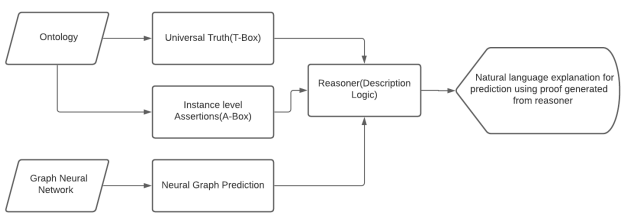
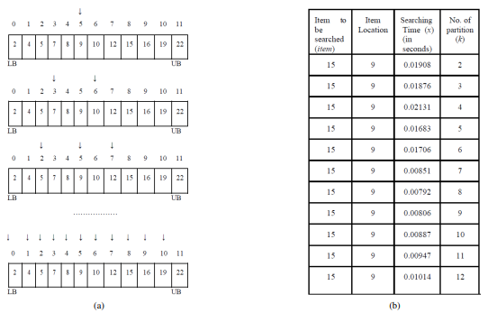
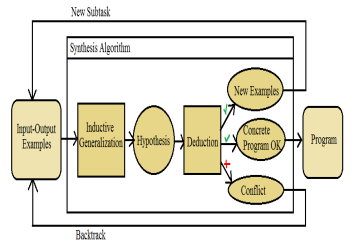



---

<!---->

### Towards Automated Evaluation of Explanations in Graph Neural Networks

Published in *ICML Workshop on Theoretic Foundation, Criticism, and Application Trend of Explainable AI,* 2021

Explaining Graph Neural Networks predictions to end users of AI applications in easily understandable terms remains an unsolved problem. In particular, we do not have well developed methods for automatically evaluating explanations, in ways that are closer to how users consume those explanations. Based on recent application trends and our own experiences in real world problems, we propose automatic evaluation approaches for GNN Explanations.

[ArXiv](https://arxiv.org/abs/2106.11864)/[Presentation](https://www.youtube.com/watch?v=oKo5be6AvHU)/[IBM Research Showcase](https://research.ibm.com/publications/towards-automated-evaluation-of-explanations-in-graph-neural-networks)

### Optimal Partition Search

Published in *IEEE International Conference on Electrical, Computer and Communication Technologies (ICECCT),* 2019

In the field of search algorithms, choosing an optimal partition that takes much less time to search a desired element in an array in comparison with other partitions is a daunting task. Traditional search algorithms such as binary search and quadratic search do not always perform better in the arrays having arbitrary size. This paper aims to develop an algorithm that gives the optimal partition to use in the array so that it fetches the desired element in an optimal time. The basic approach to implement this algorithm is taken from binary search but done the search by considering partitions starting from two up to the size of the array and calculating the searching time taken by each and every partition to search the desired element that is further compared with searching times taken by all other partitions. As a result, the algorithm then finds the optimal partition. The results show that the proposed algorithm performs well by means of giving the optimal partition on the basis of an input array having arbitrary size and an item to be searched. The basic difference between traditional searching algorithms and the proposed algorithm is that those algorithms are used for searching the desired element, but this algorithm finds the partition that searches the desired element in minimum time which makes this algorithm a generalized version of all partition searching algorithms such as linear search, binary search, and quadratic search. Moreover,this algorithm can be used as a preprocessing step for finding optimal partition and then apply searching algorithm using that partition in order to search the desired element in minimum time. Overall, the conclusion is that the optimization concept applied in this work allows finding the most favorable partition for searching an element in the array. This work can provide beneficial guidance for using search algorithms correctly in actual search space.
  
[IEEE Xplore](https://ieeexplore.ieee.org/document/8869459)/[ResearchGate](https://www.researchgate.net/publication/336638736_Optimal_Partition_Search)/[Code](https://github.com/fork123aniket/Optimal-Partition-Search)/[PyPI](https://pypi.org/project/Optimal-Partition-Search/0.0.1/)

### DeepCoder: An Approach to Write Programs

Published in *International Journal of Engineering and Manufacturing Science,* 2017

This paper presents a solution for solving simple and short problems in a competitive programming by bringing an approach of deep learning techniques from the set of input-output examples. In the deep learning approach, we usually train a neural network in an order for it to forecast the behavior or the properties of that program which generates outputs from inputs within the corresponding input-output example. This approach uses the predictions in order to increase the amount of search techniques including enumerative search technique and that of satisfiability modulo theories based on solving techniques.

[Google Scholar](https://scholar.google.co.in/citations?view_op=view_citation&hl=en&user=0pnXFqUAAAAJ&citation_for_view=0pnXFqUAAAAJ:u5HHmVD_uO8C)/[ResearchGate](https://www.researchgate.net/publication/321149674_DeepCoder_An_Approach_to_Write_Programs)
