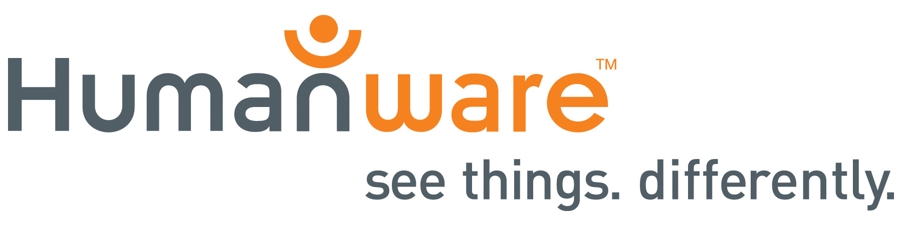
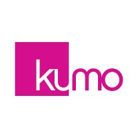
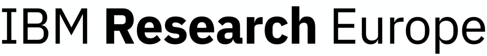



---

**Organization: *HumanWare Technologies Inc., Canada***
- ***May 2024 - Dec 2024: ML Engineer (Co-op)***
  - Designed and implemented ETL pipelines to process and prepare 3TB of unstructured image-text multimodal data for fine-tuning a Large Vision-Language Model (LVLM).
  - Developed an innovative Navigation System leveraging the fine-tuned LVLM, speech-to-text (STT) and text-to-speech (TTS) models, along with Agentic GenAI workflows to assist visually impaired users in navigating complex environments.
  - Achieved a 32% improvement in navigation accuracy compared to the existing solution, alongside a 3$\times$ reduction in system inference latency, driving a seamless and efficient user experience.
  - Successfully deployed the devised method as a live product feature that resulted in a significant jump of 25% in retention rate.

**Skills/Tools:** *PyTorch, LVLM (Fine-Tuning, Evaluation, and Benchmark), RAG, Prompting, LangChain, LangGraph, NLP (HunggingFace Transformers), CV (Object detection and Navigation), Speech Recognition & Synthesis, Distributed Training (Ray and vLLM Kernels), Linux, MLOps (AWS Bedrock)*

**Organization: *Kumo.ai, Remote***
- ***Mar 2023 - Aug 2023: Machine Learning Developer***
  - Developed and integrated new live features and operators into Kumo's PyG toolkit such as [<ins>**_Relational Graph Attention Networks_**</ins>](https://pytorch-geometric.readthedocs.io/en/latest/generated/torch_geometric.nn.conv.RGATConv.html#torch_geometric.nn.conv.RGATConv), [<ins>**_GNN Clustering for Graph-structured Data_**</ins>](https://pytorch-geometric.readthedocs.io/en/latest/generated/torch_geometric.nn.dense.DMoNPooling.html#torch_geometric.nn.dense.DMoNPooling), and [<ins>**_Model-agnostic GNN Explainability Framework_**</ins>](https://pytorch-geometric.readthedocs.io/en/latest/generated/torch_geometric.explain.algorithm.GraphMaskExplainer.html#torch_geometric.explain.algorithm.GraphMaskExplainer).
  - Designed and implemented unit tests to validate devised techniques' accuracy and efficiency.
  - Received an appreciation letter from Kumo's PyTorch Geometric toolkit's owner for making valuable contributions to their open-source library. [*View Letter*](https://github.com/fork123aniket/fork123aniket.github.io/blob/master/files/appreciation_letter.pdf)

**Skills/Tools:** *PyTorch, PyTorch Geometric (PyG), Graph Neural Networks (GNNs) Matplotlib, Scikit-learn, Critical Thinking, Research Skills*

**Organization: *IBM Systems Development Lab, India***
- ***Apr 2022 - Mar 2023: Senior Data Scientist***
  - Created a multivariate time series-based neural learning framework that utilizes generic machine learning algorithms (LSTM, GRU, and RNN) to impeccably predict run-out memory times of 300k+ storage systems in the resources pool, which resulted in the reduction of resource exhaustion time by 91%.
  - Developed a novel approach to segment storage systems based on their respective predicted behaviors in terms of average growth in usable capacity over a specific forecasting window period, which in turn helped fill the missing data present in the time series.
  - Designed and implemented pipelines for various stages of development, starting from extracting high-dimensional data in the form of multivariate time series (with underlying non-continuous dynamic) from a storage data lake to training ML time-series algorithms and predicting the storage systems' capacities.
  - Created and optimized online inference approach to quickly serve the incoming requests for storage systems' capacity predictions at scale, leading to a 70% decrease in the framework's time to respond to user traffic requests.
  - Introduced the entire framework as a fully operational machine learning-driven IBM Storage Insights product feature with low latency and high throughput, serving numerous customers' requests in real-time.

**Skills/Tools:** *TensorFlow, Time-Series Forecasting, SQL, AWS (DVC, EC2, Lambda, S3, SageMaker, CI/CD, Cloud Watch, SNS, API Gateway), Kubernetes (Docker, AWS EKS, and KubeFlow), Apache Spark, MLFlow, Git, Problem-Solving, MLOps, Research Skills*

**Organization: *IBM Research Europe***
- ***Sept 2021 - Mar 2023: ML Research Software Engineer***
  - Developed a novel unsupervised contrastive learning-based approach for the detection of similar bugs on 14TB of unstructured bug text corpus to facilitate faster log analysis. 
  - The approach extracts documents from the corpus of bug text and then implements Text Variational Autoencoders (T-VAEs)-based unsupervised anomaly detection technique to detect anomalies in the bugs corpus. Subsequently, learns a latent representation using the BERT language model to form a document embedding for each bug document, and then measures the degree of similarity between these learned document embeddings of all extracted documents using novel Word Centroids (WC) and Word Mover Distance (WMD) algorithms.
  - Introduced quantization techniques to optimize this transformer-based similarity detection method, achieving a 38% smaller and 1.8$\times$ faster model and attaining 4$\times$ inference speedup and 14% improvement on both CPU and GPU.
  - Upon obtaining the semantic-similarity scores, the approach clusters the similar bugs together based on semantic textual similarity indexing, which is governed by these computed scores.
  - Included main measures to evaluate the approach (e.g. novel and repeated). Experiments conducted on the bugs corpus strongly recommended the 100% elimination of manual detection of similar bugs. This transition not only resulted in an impressive 85% reduction in response time to address client-reported bugs but also empowered the support team to focus solely on handling new and unique bug instances.
  - Rolled out the devised method as a real-time IBM Storage Insights product feature functionality, accessible to a broad customer spectrum.

**Skills/Tools:** *PyTorch, NLP, Anomaly Detection, PostgreSQL, AWS (DVC, EC2, Lambda, S3, SageMaker, CI/CD, Cloud Watch, SNS, API Gateway), Kubernetes (Docker, AWS EKS, and KubeFlow), ML Explainability, HuggingFace, MLFlow, Apache Spark & Kafka, Model Compression & Quantization, Problem-Solving, MLOps, Research & Leadership Skills*

**Organization: *IBM Research India***
- ***July 2020 - Dec 2022: ML Research Software Engineer***
  - Developed a framework that converts property graphs of domain-specific ontologies into large-scale enterprise heterogeneous knowledge graphs, leveraging the multi-layered [<ins>**_RGCN_**</ins>](https://arxiv.org/abs/1703.06103) model for entity label prediction. This solution reduced entity duplication by 40%, improved data accuracy by 20%, and delivered $100K in annual savings on data management costs.
  - Proposed and deployed an automated approach to evaluate GNN explanations, enhancing the reliability of predictions on graph-structured data. Work published at the [<ins>**_Explainable AI Workshop at ICML 2021_**</ins>](https://arxiv.org/html/2107.08821#:~:text=title%3A%20towards%20automated%20evaluation%20of%20explanations%20in%20graph%20neural%20networks) and integrated as a live feature in IBM AI Explainability 360 toolkit under the IBM Research Trusted AI initiative.
  - Filed 2 patents: (i) Secure graph learning for classifying data ontologies; (ii) Faster deduplication of records to improve customer-specific assets in Data Fabric.
  - Developed a lightweight unsupervised framework for clustering heterogeneous graphs in Master Data, generating minimal sub-structures with highly similar nodes. The framework leverages graph topology and node embeddings to ensure clusters are both strongly connected and feature-similar.

**Skills/Tools:** *PyTorch, PyTorch Geometric, Graph Neural Networks, Classification & Clustering for Graph Data, NetworkX, IBM Cloud Pak for Data (CP4D), Linux, Git, REST API, Problem-Solving, Research & Brainstorming Skills, Critical Thinking*

**Organization: *IBM Consulting, India***
- ***Sept 2018 - July 2020: Data Scientist***
  - Built a machine learning platform from scratch for monitoring and tracking the traversed path of 120k vessels.
  - Wrangled 1.5TB of vessel trading data stored in the Synapse database to train a Machine Learning regressive prediction algorithm and implemented an offline batch inference method for vessel trajectory prediction (in terms of longitudes and latitudes), which reduced the overall vessel traversal logistics time by 27%.
  - Led a cost-saving initiative by devising an automated ML approach to predict the Time Charter (TC) Rate to identify the best vessel at the lowest price based on the availability of the vessels, leading to an annual cost reduction exceeding $70,000 in logistics expenditures.
  - Optimized the developed ML platform by implementing an explainability solution to identify influential features in the data for the prediction algorithm, resulting in improved trained ML model accuracy from 65% to 86% for both TC Rate and vessel trajectory prediction tasks.
  - Integrated a data visualization framework into the platform for creating intuitive as well as user-interactive visualizations and launched the developed machine learning platform for production use, allowing 2k+ end clients to discover, on the fly, daily patterns in vessels movement and track the regular impact of vessel trades on liquidity.
 
**Skills/Tools:** *PyTorch, TensorFlow, Scikit-learn, Pandas, Numpy, SQL, MLFlow, Azure (CI/CD Pipeline, Azure ML, Azure Kubernetes Service with Docker and KubeFlow, Databricks, Serverless, Synapse Analytics), ML Explainability, Regression, ETL Processes, Git, Problem-Solving, Research & Brainstorming Skills, Critical Thinking, MLOps & Deployment*
