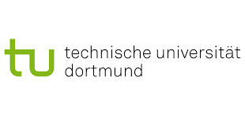



---

**Organization: *IBM Consulting, India***
- ***Nov 2018 - July 2020: Data Scientist***
  - Built a data analytics platform from scratch for monitoring and tracking the traversed path of the ship.
  - Implemented various regressive prediction algorithms such as feedforward networks, support vector regression, etc.
	as a part of the platform to predict the movement of the ship in terms of longitudes and latitudes.
  - Implemented an automated pipeline for pulling data from the PostgreSQL database and preprocessing it before
	feeding it into the prediction algorithms.
  - Integrated an intuitive data visualization framework, built using the Dash-Plotly library, into the data analytics
	platform for creating intuitive visualizations for the ship strategy data obtained from various tables of the PostgreSQL
	database and discovered daily patterns in moving directions of the ship that could aid our prediction algorithms.
  - Implemented an explainability solution by computing Shapley values for the features present in the dataset using
	the Scikit-Learn library. Features that had higher Shapley values had been considered more important for the
	prediction made by the prediction algorithms.

**Organization: *Technical University of Dortmund, Germany***
- ***Dec 2020 - June 2021: Research Intern***
  - Designed and implemented a unique post-hoc model-agnostic Graph Neural Networks (GNNs) explainability
	framework. Unlike other traditional GNN explainability methods, the implemented approach does not require
	retraining to generalize explanations to new instances for both node as well as graph classification tasks.
  - The framework takes a trained GNN model along with some meta-data information of the input graph as input,
	computes layer-wise edge importance weights, and outputs an explanatory subgraph.
---

**Organization: *IBM Research, India***
- ***July 2020 - Dec 2022: Research Associate***
  - Worked on creating a framework to transform the domain-specific tabular data into heterogeneous knowledge
	graphs. The framework consumes tabular data as a property graph (unique to different domains), models the
	various available relations in the knowledge graph using multi-layered RGCN, and generates a domain-level
	importance weight for each relation present in the input relational graph as output.
  - To make the overall approach interpretable, introduced an explainability component in the framework to produce
	human-intelligible explanations for every single prediction being made for the input knowledge graph.
  - Developed and analyzed an automated approach to further evaluate GNN explanations to boost their applicability
	to end users, thereby promoting the creation of more complex as well as trusted AI systems for the Graph-structured
	domain. Work got published in the [Explainable AI Workshop at ICML 2021](https://icml2021-xai.github.io/).
  - The developed framework was also employed to create a novel large-scale graph representation learning dataset
	called the TACRED people dataset, which is being used by other teams in the lab to accelerate graph ML research.
  - Developed and implemented an unsupervised and computationally light framework that facilitates clustering to
	partition each heterogeneous graph associated with every single entity present in Master Data to generate the
	smallest possible graph sub-structures for each entity having only monumental similar nodes clustered together.
	Moreover, the framework takes into account the primitive structure as well as node embeddings of each entity’s
	heterogeneous graphs to cluster the nodes according to the graph topology (nodes in the same cluster should be
	strongly connected) and to the node features (nodes in the same cluster should have similar features).
---

**Organization: *IBM Research, Zurich***
- ***Feb 2021 - Dec 2021: Research Associate***
  - Developed a novel unsupervised contrastive learning-based approach for the detection of similar bugs to facilitate
	faster log analysis. The approach extracts documents from the corpus of bug text, learns a latent representation
	using a pre-trained BERT language model to form a document embedding for each document, and then measures
	the degree of similarity between these learned document embeddings of all extracted documents using newly
	proposed Word Centroids (WC) and Word Mover Distance (WMD) algorithms.
  - Upon obtaining the semantic-similarity scores, the approach clusters the similar bugs together based on semantic
	textual similarity indexing, which is governed by these computed scores.
  - Included main measures to evaluate the approach (e.g. novel and repeated). Experiments conducted on the
	synthetic bugs corpus strongly recommended the complete elimination of manual detection of similar bugs.
---

**Organization: *IBM Systems Development Lab, India***
- ***Apr 2022 - June 2023: Software Developer***
  - Created a time series-based neural learning framework for predicting the capacity of storage systems.
  - Utilized generic machine learning algorithms (LSTM, Linear Regression, and RNN) to impeccably predict run-out
	memory times of storage systems in the resources pool.
  - Developed a novel approach to segment storage systems based on their respective predicted behaviors in terms of
	average growth in usable capacity over a specific forecasting window period, which in turn helped fill the missing
	data present in the time series.
  - Implemented a data extraction pipeline to extract data in the form of multivariate time series from a storage data
	lake. Work done in close collaboration with *IBM Research, Almaden*.

