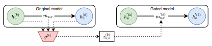

<!---->

- This contribution aims at adding a **Graph Explainability solution** powered by **hard-concrete distribution** to PyTorch Geometric.
based on **Spectral Modularity Maximization**.
- 
Implemented a <i>post-hoc model-agnostic graph explainability</i> technique, which, at every hidden layer of the GNN model, computed explanation weights for  
  every edge in the population and produced explanatory subgraph as output.

- 
Softmax activation is then applied to the output of GCN to obtain <i>soft</i>, yet  
  <i>differentiable cluster assignments</i> being made for the input graph.

- 
Implemented custom unit tests to ensure proper execution of the Graph 
  Explainability technique.

- Libraries/Framework: Numpy, tqdm, PyTorch, PyTorch Geometric, and PyTest

[PyTorch Geometric](https://pytorch-geometric.readthedocs.io/en/latest/modules/contrib.html#torch_geometric.contrib.explain.GraphMaskExplainer)/[Code](https://github.com/fork123aniket/Model-agnostic-Graph-Explainability-from-Scratch)
