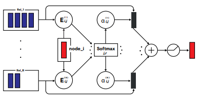

<!---->

- This contribution relates to bringing attention to heterogeneous (relational) graphs and incorporating this
relation-aware attention operator into PyTorch Geometric Library.
- Offers two different mechanisms to compute attention for relational graphs, i.e. **within-relation** and **across-relation**.
- This implementation also provides four different cardinality preservation options (**additive**, **scaled**, **f-additive**, and
**f-scaled**) to further improve attention computation for the heterogeneous graphs.
- Wrote custom unit tests to verify the technique’s accuracy.
- Libraries/Framework: torch-scatter, torch-sparse, PyTorch, PyTorch Geometric, and PyTest

[PyTorch Geometric](https://pytorch-geometric.readthedocs.io/en/latest/generated/torch_geometric.nn.conv.RGATConv.html#torch_geometric.nn.conv.RGATConv)/[Code](https://github.com/fork123aniket/Relational-Graph-Attention-from-Scratch)
